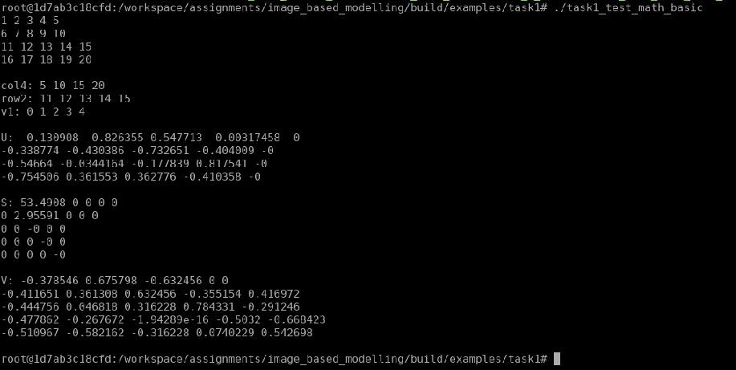
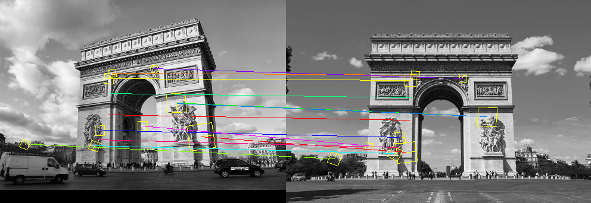
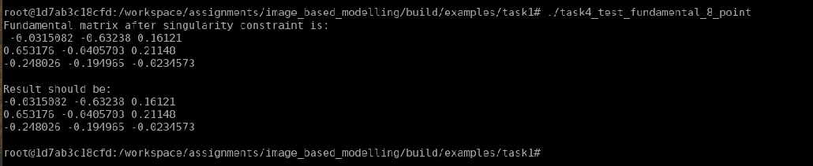
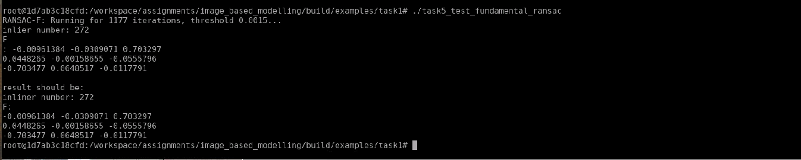

# 3D Reconstruction: Camera Model & Epipolar Geometry

---

## 1. 完成 task2_test_camera.cc 中相机的 3 个类函数

相机投影函数的实现如下:

```c++
    // 相机投影过程
    Eigen::Vector2d projection(const Eigen::Vector3d &P){
        //
        // a. project to normalized plane:
        // 
        Eigen::Vector3d P_normalized;

        Eigen::Matrix3d R = Eigen::Matrix<
            double, 
            Eigen::Dynamic, Eigen::Dynamic, Eigen::RowMajor
        >::Map(
            R_,
            3, 3
        );
        Eigen::Vector3d t = Eigen::Matrix<
            double, 
            Eigen::Dynamic, Eigen::Dynamic, Eigen::RowMajor
        >::Map(
            t_,
            3, 1
        );

        P_normalized = R*P + t;

        // b. calculate distortion factor:
        Eigen::Vector2d p_normalized = Eigen::Vector2d(
            P_normalized.x() / P_normalized.z(), 
            P_normalized.y() / P_normalized.z()
        );

        double r_2 = p_normalized.squaredNorm();
        double r_4 = r_2 * r_2;
        double distortion_factor = 1.0 + dist_[0] * r_2 + dist_[1] * r_4;

        // c. project to image plane:
        Eigen::Vector2d p;
        Eigen::Vector2d c = Eigen::Matrix<
            double, 
            Eigen::Dynamic, Eigen::Dynamic, Eigen::RowMajor
        >::Map(
            c_,
            2, 1
        );

        p = f_ * distortion_factor * p_normalized + c;

        return p;
    }
```

程序运行结果如下:



---

## 2. 填充 matching.h 中函数 oneway_match() 函数中关于 lowe-ratio 利用最近邻与次近邻比进行筛选的代码部分, 完成后测试 examples/task1/task3_test_matching.cc 函数， 比较添加 lowe-ratio 前后的匹配效果

利用最近邻与次近邻比进行筛选的代码实现如下:

```c++
    // 标准2： 与最近邻和次紧邻的距离比必须小于特定阈值
    float square_dist_1st_best = static_cast<float>(nn_result.dist_1st_best);
    float square_dist_2st_best = static_cast<float>(nn_result.dist_2nd_best);
    float const square_lowe_thres = MATH_POW2(options.lowe_ratio_threshold);

    if (
        square_dist_1st_best / square_dist_2st_best > square_lowe_thres
    )
        continue;
```

程序运行结果如下:

Simple Threshold           |2-NN Threshold
:-------------------------:|:-------------------------:
  |  

---

## 3. 推导并掌握 slides 中直接线性变化法(8点法), 完 task4_test_fundamental_8_point.cc 中的函数

直接线性变化法的实现如下:

```c++
FundamentalMatrix fundamental_8_point (
    math::Matrix<double, 3, 8> const& points1, 
    math::Matrix<double, 3, 8> const& points2
){ 
    FundamentalMatrix F;

    //
    // a. build linear systems to get unconstrained F:
    //
    Eigen::MatrixXd A(N, 9);
    for (int n = 0; n < N; ++n) {
        A(n, 0) = points2(U, n) * points1(U, n);
        A(n, 1) = points2(U, n) * points1(V, n);
        A(n, 2) = points2(U, n);
        A(n, 3) = points2(V, n) * points1(U, n);
        A(n, 4) = points2(V, n) * points1(V, n);
        A(n, 5) = points2(V, n);     
        A(n, 6) = points1(U, n);
        A(n, 7) = points1(V, n);
        A(n, 8) = 1.0;
    }

    // TODO: figure out why SAES would fail here
    Eigen::JacobiSVD<Eigen::MatrixXd> saes(A, Eigen::ComputeFullV);
    Eigen::MatrixXd F_unconstrained = Eigen::Matrix<
        double, 
        Eigen::Dynamic, Eigen::Dynamic, Eigen::RowMajor
    >::Map(
        saes.matrixV().col(8).data(),
        3, 3
    );

    //
    // b. apply singular value constraint on unconstrained F:
    //
    Eigen::JacobiSVD<Eigen::MatrixXd> svd(F_unconstrained, Eigen::ComputeFullU | Eigen::ComputeFullV);

    Eigen::VectorXd S = svd.singularValues();
    S(2) = 0.0;

    Eigen::MatrixXd F_constrained = svd.matrixU() * (S.asDiagonal()) * svd.matrixV().transpose();

    for (int i = 0; i < 3; ++i) {
        for (int j = 0; j < 3; ++j) {
            F(i, j) = F_constrained(i, j);
        }
    }

    return F;
}
```

程序运行的结果如下:



---

## 4. 掌握 RANSAC 方法的基本原理,掌握 RANSAC 求解基础矩阵的原理和过程,完成 task5_test_fundamental_ransac.cc 中函数

计算迭代次数的函数实现如下:

```c++
int calc_ransac_iterations(
    double p,
    int K,
    double z = 0.99
){
    double prob_all_inliers = std::pow(p, K);

    int M = static_cast<int>(std::log(1.0 - z) / std::log(1.0 - prob_all_inliers)) + 1;

    return M;
}
```

选择内点的函数实现如下:

```c++
std::vector<int> find_inliers(
    sfm::Correspondences2D2D const &matches, 
    const FundamentalMatrix &F, 
    const double &thresh
){
    const double squared_thresh = thresh* thresh;

    std::vector<int> inliers;

    const int N = static_cast<int>(matches.size());

    for (int n = 0; n < N; ++n) {
        const auto &m = matches.at(n);

        if (calc_sampson_distance(F, m) < squared_thresh) {
            inliers.push_back(n);
        }
    }

    return std::move(inliers);
}
```

程序运行的结果如下:



---

## 5. 掌握从本质矩阵中求相机参数的方法, 完成 task6_test_pose_from_fundamental.cc 中的相关函数

求解本征矩阵以及相机参数的实现如下:

```c++
bool calc_cam_poses(
    FundamentalMatrix const &F, 
    const double f1, const double f2, 
    Eigen::Matrix3d& R, Eigen::Vector3d& t
) {
    //
    // a. calculate essential matrix:
    //
    Eigen::Matrix3d K1 = Eigen::Matrix3d::Identity();
    K1(0, 0) = K1(1, 1) = f1;

    Eigen::Matrix3d K2 = Eigen::Matrix3d::Identity();
    K2(0, 0) = K2(1, 1) = f2;

    Eigen::Matrix3d E;
    for (int i = 0; i < 3; ++i) {
        for (int j = 0; j < 3; ++j) {
            E(i, j) = F(i, j);
        }
    }
    E = K2.transpose() * E * K1;

    std::cout << "EssentialMatrix result is " << std::endl 
              << E << std::endl;
    std::cout << "EssentialMatrix should be: \n"
              << "-0.00490744 -0.0146139 0.34281\n"
              << "0.0212215 -0.000748851 -0.0271105\n"
              << "-0.342111 0.0315182 -0.00552454\n";

    //
    // b. generate camera pose proposals:
    //
    Eigen::JacobiSVD<Eigen::MatrixXd> svd(
        E, 
        Eigen::ComputeFullU | Eigen::ComputeFullV
    );

    Eigen::Matrix3d R_z = Eigen::AngleAxisd(M_PI_2, Eigen::Vector3d::UnitZ()).matrix();

    Eigen::Vector3d t1 = -svd.matrixU().col(2);
    Eigen::Vector3d t2 =  svd.matrixU().col(2);
    Eigen::Matrix3d R1 =  svd.matrixU() * R_z.transpose() * svd.matrixV().transpose();
    if ( R1.determinant() < 0.0 ) {
        R1 = -R1;
    }
    Eigen::Matrix3d R2 =  svd.matrixU() * R_z * svd.matrixV().transpose();
    if ( R2.determinant() < 0.0 ) {
        R2 = -R2;
    }
    std::vector<Eigen::Matrix4d> candidate_poses;

    Eigen::Matrix4d T;

    T.block<3, 3>(0, 0) = R1; T.block<3, 1>(0, 3) = t1;
    candidate_poses.push_back(T);
    T.block<3, 3>(0, 0) = R1; T.block<3, 1>(0, 3) = t2;
    candidate_poses.push_back(T);
    T.block<3, 3>(0, 0) = R2; T.block<3, 1>(0, 3) = t1;
    candidate_poses.push_back(T);
    T.block<3, 3>(0, 0) = R2; T.block<3, 1>(0, 3) = t2;
    candidate_poses.push_back(T);

    //
    // c. find correct pose:
    // 
    for (const auto &pose: candidate_poses) {
        if ( is_correct_pose(K1, K2, pose) ) {
            R = pose.block<3, 3>(0, 0);
            t = pose.block<3, 1>(0, 3);

            std::cout << "Valid camera pose: " << std::endl;
        } else {
            std::cout << "INVALID camera pose: " << std::endl;
        }

        std::cout << "\tR:" << std::endl;
        std::cout << pose.block<3, 3>(0, 0) << std::endl;
        std::cout << "\tt:" << std::endl;
        std::cout << pose.block<3, 1>(0, 3) << std::endl;
        std::cout << std::endl;
    }

    return false;
}
```

程序运行的结果如下:

