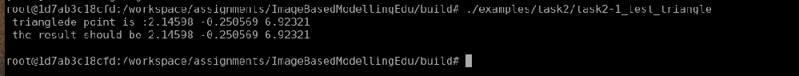
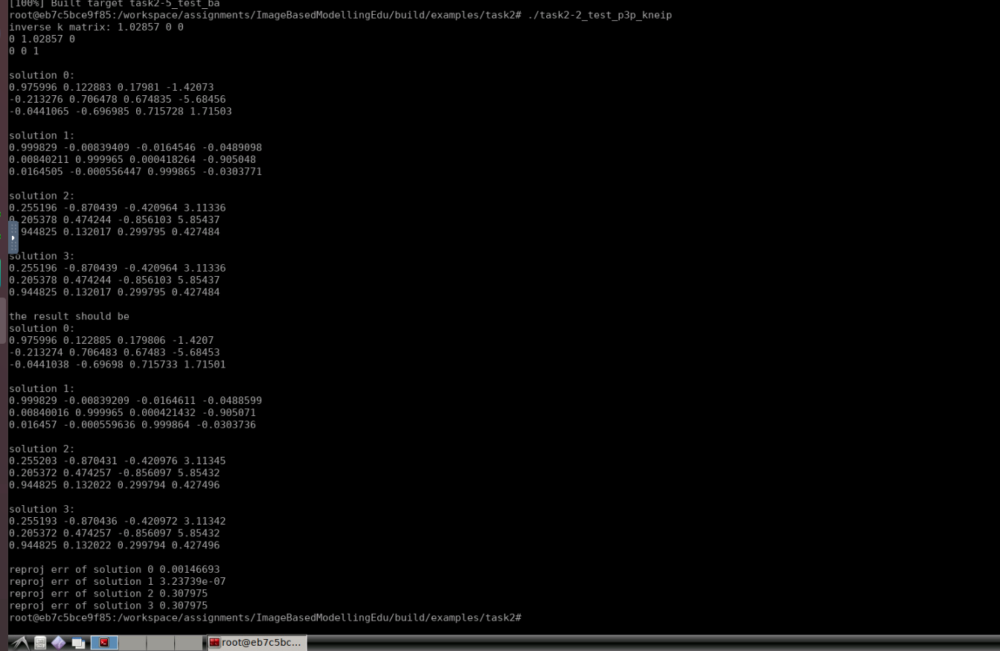
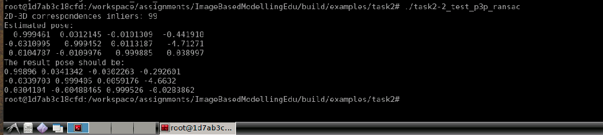
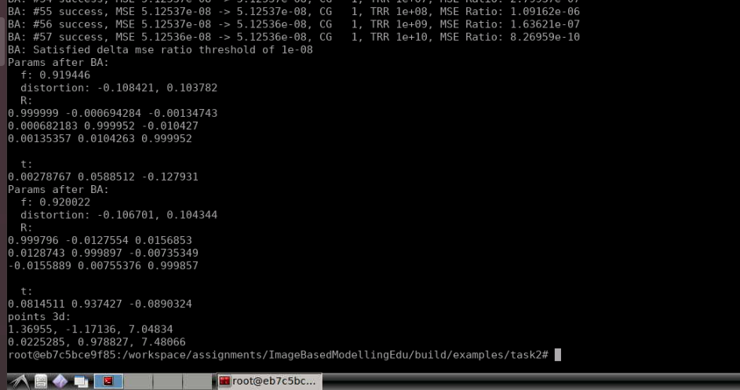
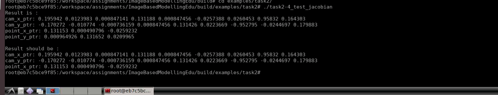
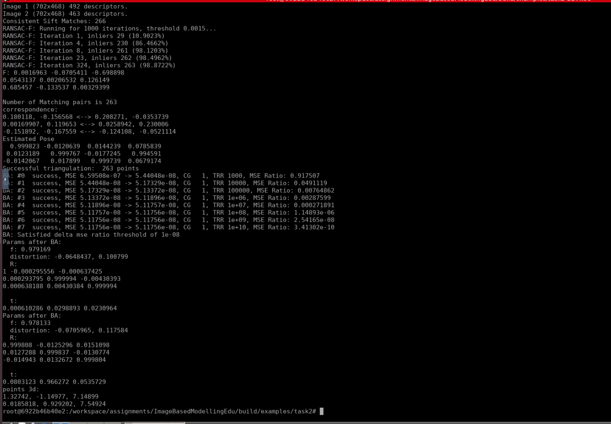

# 3D Reconstruction: Motion Estimation

---

## 1. 完成task2-1_test_triangle.cc, 实现线性三角化算法(Linear triangulation methods)

线性三角化算法的实现如下. 此处基于Eigen实现矩阵运算[here](task2-1_test_triangle.cc#L49):

```c++
    // the corresponding projection points:
    Eigen::Vector2d p1(
         0.2899860,
        -0.0355493
    );
    Eigen::Vector2d p2(
        0.3161540,
        0.0898488
    );

    Eigen::MatrixXd P1(3, 4), P2(3, 4);

    P1 << 0.919653000, -0.000621866, -0.00124006,  0.00255933,
          0.000609954,  0.919607000, -0.00957316,  0.05407530,
          0.001354820,  0.010408700,  0.99994900, -0.12762400;

    P2 << 0.9200390, -0.01172140,  0.01442989,  0.0749395,
          0.0118301,  0.92012900, -0.00678373,  0.8627110,
         -0.0155846,  0.00757181,  0.99985400, -0.0887441;

    // build A matrix:
    Eigen::MatrixXd A(4, 4);

    A.block<1, 4>(0, 0) = P1.block<1, 4>(0, 0) - p1.x()*P1.block<1, 4>(2, 0);
    A.block<1, 4>(1, 0) = P1.block<1, 4>(1, 0) - p1.y()*P1.block<1, 4>(2, 0);
    A.block<1, 4>(2, 0) = P2.block<1, 4>(0, 0) - p2.x()*P2.block<1, 4>(2, 0);
    A.block<1, 4>(3, 0) = P2.block<1, 4>(1, 0) - p2.y()*P2.block<1, 4>(2, 0);

    // solve X:
    Eigen::JacobiSVD<Eigen::MatrixXd> svd(A, Eigen::ComputeThinV);
    Eigen::VectorXd X_homogeneous = svd.matrixV().col(3);
    Eigen::Vector3d X(
        X_homogeneous(0) / X_homogeneous(3),
        X_homogeneous(1) / X_homogeneous(3),
        X_homogeneous(2) / X_homogeneous(3)
    );

    std::cout<<" trianglede point is :"<< X.x() <<" "<< X.y() <<" "<< X.z() <<std::endl;
    std::cout<<" the result should be "<<"2.14598 -0.250569 6.92321\n"<<std::endl;

    return EXIT_SUCCESS;
```

程序运行结果如下:



---

## 2.a 实现 task2-2_test_p3p_kneip.cc 中的P3P Kneip算法 

此处使用Eigen实现**Kneip Equation Solver**以及**Camera Pose Reconstruction**

**Kneip Equation Solver**的实现如下[here](task2-2_test_p3p_kneip.cc#L260):

```c++
std::vector<std::pair<double, double>> SolveKneipEquation(
    const Eigen::Vector3d &F1, const Eigen::Vector3d &F2,
    const Eigen::Vector3d &P1, const Eigen::Vector3d &P2,
    const Eigen::Vector3d &F3_new_camera, const Eigen::Vector3d &P3_new_world
) {
    //
    // build Kneip equation:
    //    
    Eigen::Matrix<double, 5, 1> kneip_equation;

    const double p_x = P3_new_world.x();
    const double p_y = P3_new_world.y();

    const double theta_x = F3_new_camera.x() / F3_new_camera.z();
    const double theta_y = F3_new_camera.y() / F3_new_camera.z();

    const double d_12 = (P2 - P1).norm();

    const double b = F1.dot(F2) / F1.cross(F2).norm();

    const double p_x_2 = p_x*p_x;
    const double p_x_3 = p_x_2*p_x;
    const double p_x_4 = p_x_2*p_x_2;

    const double p_y_2 = p_y*p_y;
    const double p_y_3 = p_y_2*p_y;
    const double p_y_4 = p_y_2*p_y_2;

    const double theta_x_2 = theta_x*theta_x;
    const double theta_y_2 = theta_y*theta_y;

    const double d_12_2 = (P2 - P1).squaredNorm();

    const double b_2 = b*b;

    kneip_equation(4,0) = - theta_y_2 * p_y_4 - p_y_4 * theta_x_2 - p_y_4;

    kneip_equation(3,0) =   2.0 * p_y_3 * d_12 * b
                          + 2.0 * theta_y_2 * p_y_3 * d_12 * b
                          - 2.0 * theta_y * p_y_3 * theta_x * d_12;

    kneip_equation(2,0) = - theta_y_2 * p_y_2 * p_x_2
                          - theta_y_2 * p_y_2 * d_12_2 * b_2
                          - theta_y_2 * p_y_2 * d_12_2
                          + theta_y_2 * p_y_4
                          + p_y_4 * theta_x_2
                          + 2.0 * p_x * p_y_2 * d_12
                          + 2.0 * theta_x * theta_y * p_x * p_y_2 * d_12 * b
                          - p_y_2 * p_x_2 * theta_x_2
                          + 2.0 * p_x * p_y_2 * theta_y_2 * d_12
                          - p_y_2 * d_12_2 * b_2
                          - 2.0 * p_x_2 * p_y_2;

    kneip_equation(1,0) =   2.0 * p_x_2 * p_y * d_12 * b
                          + 2.0 * theta_y * p_y_3 * theta_x * d_12
                          - 2.0 * theta_y_2 * p_y_3 * d_12 * b
                          - 2.0 * p_x * p_y * d_12_2 * b;

    kneip_equation(0,0) = - 2.0 * theta_y * p_y_2 * theta_x * p_x * d_12 * b
                          + theta_y_2 * p_y_2 * d_12_2
                          + 2.0 * p_x_3 * d_12
                          - p_x_2 * d_12_2
                          + theta_y_2 * p_y_2 * p_x_2
                          - p_x_4
                          - 2.0 * theta_y_2 * p_y_2 * p_x * d_12
                          + p_y_2 * theta_x_2 * p_x_2
                          + theta_y_2 * p_y_2 * d_12_2 * b_2;

    //
    // solve using QR decomposition:
    //
    Eigen::PolynomialSolver<double, 4> psolve( kneip_equation );
    std::vector<std::pair<double, double>> results;

    const auto &roots = psolve.roots();
    for (size_t i = 0; i < roots.size(); ++i) {
        const double cos_theta = roots(i).real();
        const double cot_alpha = (theta_x*p_x + cos_theta*p_y*theta_y - d_12*b*theta_y) / (theta_x*cos_theta*p_y - p_x*theta_y + d_12*theta_y);

        results.emplace_back(cos_theta, cot_alpha);
    }

    return std::move(results);
}
```

**Camera Pose Reconstruction**的实现如下[here](task2-2_test_p3p_kneip.cc#L355):

```c++
void PoseP3PKneip(
    math::Vec3d p1, math::Vec3d p2, math::Vec3d p3,
    math::Vec3d f1, math::Vec3d f2, math::Vec3d f3,
    std::vector<math::Matrix<double, 3, 4> >* solutions
) {
    //
    // format as Eigen:
    //
    Eigen::Vector3d P1(p1[0], p1[1], p1[2]);
    Eigen::Vector3d P2(p2[0], p2[1], p2[2]);
    Eigen::Vector3d P3(p3[0], p3[1], p3[2]);

    Eigen::Vector3d F1(f1[0], f1[1], f1[2]);
    Eigen::Vector3d F2(f2[0], f2[1], f2[2]);
    Eigen::Vector3d F3(f3[0], f3[1], f3[2]); 

    //
    // build new world frame:
    //
    Eigen::Matrix3d R_new_world = Eigen::Matrix3d::Identity();
    R_new_world.block<3, 1>(0, 0) = (P2 - P1).normalized();
    R_new_world.block<3, 1>(0, 2) = R_new_world.col(0).cross(P3 - P1).normalized();
    R_new_world.block<3, 1>(0, 1) = R_new_world.col(2).cross(R_new_world.col(0));

    //
    // build new camera frame:
    //
    Eigen::Matrix3d R_new_camera = Eigen::Matrix3d::Identity();
    R_new_camera.block<3, 1>(0, 0) = F1.normalized();
    R_new_camera.block<3, 1>(0, 2) = F1.cross(F2).normalized();
    R_new_camera.block<3, 1>(0, 1) = R_new_camera.col(2).cross(R_new_camera.col(0));

    //
    // project f3 to new camera frame:
    //
    Eigen::Vector3d P3_new_world = R_new_world.transpose()*(P3 - P1);
    Eigen::Vector3d F3_new_camera = R_new_camera.transpose()*F3;

    //
    // get candidate poses:
    //
    auto result = SolveKneipEquation(
        F1, F2, P1, P2, F3_new_camera, P3_new_world
    );

    //
    // construct candidate poses:
    //
    const double d_12 = (P2 - P1).norm();
    const double b = F1.dot(F2) / F1.cross(F2).norm();
    for (size_t i = 0; i < result.size(); ++i) {
        const auto &params = result.at(i);

        // TODO: handle the sign of theta
        const double &cos_theta = params.first;
        const double sin_theta = std::sqrt(1.0 - cos_theta*cos_theta);

        const double &cot_alpha = params.second;

        const double sin_alpha = std::sqrt(1.0 / (cot_alpha*cot_alpha + 1.0));
        const double cos_alpha = (cot_alpha < 0.0 ? -1.0 : 1.0) * std::sqrt(1.0 - sin_alpha*sin_alpha);

        //
        // 1. rotation around x, new world frame:
        //
        Eigen::Matrix3d R_theta = Eigen::Matrix3d::Identity();
        R_theta(1, 1) = cos_theta; R_theta(1, 2) = -sin_theta;
        R_theta(2, 1) = sin_theta; R_theta(2, 2) =  cos_theta;

        //
        // 2. rotation around z, new world frame:
        //
        Eigen::Matrix3d R_alpha = Eigen::Matrix3d::Identity();
        R_alpha(0, 0) = -cos_alpha; R_alpha(0, 1) =  sin_alpha;
        R_alpha(1, 0) = -sin_alpha; R_alpha(1, 1) = -cos_alpha;

        //
        // camera pose:
        //
        // 1. orientation:
        Eigen::Matrix3d R_camera = R_new_world*R_theta*R_alpha*R_new_camera.transpose();
        // 2. position:
        const double cp1 = d_12*(sin_alpha*b + cos_alpha);
        Eigen::Vector3d t_camera(cp1*cos_alpha, cp1*sin_alpha, 0.0);
        t_camera = R_new_world*R_theta*t_camera + P1;

        //
        // follow output specification:
        //
        Eigen::Matrix4d T_camera = Eigen::Matrix4d::Identity();
        T_camera.block<3, 3>(0, 0) =  R_camera.transpose();
        T_camera.block<3, 1>(0, 3) = -R_camera.transpose()*t_camera;

        std::cout << "Solution " << i << ": " << cos_theta << ", " << cot_alpha << std::endl;
        std::cout << std::endl << T_camera.block<3, 4>(0, 0) << std::endl;
    }
}
```

程序运行结果如下:



---

## 2.b 实现 task2-2_test_p3p_ransac.cc 中的RANSAC P3P Kneip算法 

使用Eigen重新实现的**RANSAC P3P Kneip**如下:

```c++
int GetNumInliers(
    const sfm::Correspondences2D3D &corrs,
    const Eigen::Matrix3d &K,
    const Eigen::Matrix4d &T_camera,
    const double &threshold
) {
    int num_inliers = 0;

    const Eigen::Matrix3d R_camera = T_camera.block<3, 3>(0, 0);
    const Eigen::Vector3d t_camera = T_camera.block<3, 1>(0, 3);

    for (const auto &corr: corrs) {
        Eigen::Map<const Eigen::Vector3d> P(corr.p3d);
        Eigen::Map<const Eigen::Vector2d> p(corr.p2d);

        Eigen::Vector3d p_homo = K*R_camera.transpose()*(P - t_camera);
        Eigen::Vector2d p_observed(
            p_homo.x() / p_homo.z(),
            p_homo.y() / p_homo.z()
        );

        if ( (p - p_observed).norm() < threshold ) ++num_inliers;
    }

    return num_inliers;
}

int main(int argc, char* argv[]){
    Eigen::Matrix3d K = Eigen::Matrix3d::Zero();
    K(0, 0) = k_matrix[0]; K(0, 2) = k_matrix[2];
    K(1, 1) = k_matrix[4]; K(1, 2) = k_matrix[5];
    K(2, 2) = k_matrix[8];
    Eigen::Matrix3d K_inv = K.inverse();

    // Ransac中止条件，内点阈判断
    sfm::RansacPoseP3P::Options pose_p3p_opts;

    //
    // here implement RANSAC as a simple procedure:
    // 
    // at least 3 correspondences are needed:
    if ( corrs.size() < 3 ) {
        throw std::invalid_argument("At least 3 correspondences are needed. Check input data.");
    } 

    //
    // RANSAC:
    //

    // result:
    int num_inliers_optimal = 0;
    Eigen::Matrix4d T_camera_optimal;

    // init random correspondence generator:
    std::random_device rd;
    std::mt19937 gen(rd());
    std::uniform_int_distribution<> distrib(0, corrs.size() - 1);
    pose_p3p_opts.max_iterations = 10000;
    for (int i = 0; i < pose_p3p_opts.max_iterations; ++i) {
        //
        // generate candidate:
        //
        std::set<int> indices;
        while( indices.size() < 3 ){
            int idx = distrib(gen);
            indices.insert(idx);
        }

        //
        // solve Kneip P3P:
        //
        std::vector<Eigen::Vector3d> Ps;
        std::vector<Eigen::Vector3d> fs;
        for (const int &index: indices) {
            Eigen::Map<const Eigen::Vector3d> P(corrs.at(index).p3d);
            Eigen::Map<const Eigen::Vector2d> f(corrs.at(index).p2d);

            Ps.push_back(P);
            fs.push_back(K_inv*Eigen::Vector3d(f.x(), f.y(), 1.0));
        }

        std::vector<Eigen::Matrix4d> poses = PoseP3PKneip(Ps, fs);

        //
        // evaluate:
        //
        for (const auto &T: poses) {
            int num_inliers = GetNumInliers(corrs, K, T, pose_p3p_opts.threshold);

            if ( num_inliers > num_inliers_optimal ) {
                num_inliers_optimal = num_inliers;
                T_camera_optimal = T;
            }
        }
    }

    std::cout << "2D-3D correspondences inliers: " << (100 * num_inliers_optimal / corrs.size())<<std::endl;
    std::cout << "Estimated pose: " << std::endl;
    std::cout << T_camera_optimal.inverse().block<3, 4>(0, 0) << std::endl;

    std::cout<<"The result pose should be:"<<std::endl;
    std::cout<<
    "0.99896 0.0341342 -0.0302263 -0.292601\n"
    "-0.0339703 0.999405 0.0059176 -4.6632\n"
    "0.0304104 -0.00488465 0.999526 -0.0283862\n"<<std::endl;

    return EXIT_SUCCESS;
}
```

程序运行结果如下:



---

## 3. 熟悉并掌握Levenberg-Marquardt

此处使用Eigen实现Jacobian的计算与基于Schur Complement的估计量求解.

**BA Jacobians**的计算如下, 基于Eigen SparseMatrix实现[here](task2-3_test_lm_optimize.cc#L855). 残差Jacobian的计算参见[here](task2-3_test_lm_optimize.cc#L782)**问题4**

```c++
void GetBAErrorJacobians(
    Eigen::SparseMatrix<double> &J_cams,
    Eigen::SparseMatrix<double> &J_points
) {
    //
    // determine BA problem size:
    //
    const int C = static_cast<int>(cameras.size());
    const int P = static_cast<int>(points.size());
    const int N = static_cast<int>(observations.size());

    // 
    // coeffs container for J_cams & J_points:
    // 
    std::vector<Eigen::Triplet<double>> J_cams_coeffs;
    std::vector<Eigen::Triplet<double>> J_points_coeffs;

    //
    // get Jacobians for bundle adjustment error:
    //
    Eigen::MatrixXd J_cam(2, 9), J_point(2, 3);
    for (int i = 0; i < N; ++i) {
        //
        // parse observation:
        //
        const sfm::ba::Observation &obs = observations.at(i);
        const sfm::ba::Camera &cam = cameras.at(obs.camera_id);
        const sfm::ba::Point3D &point = points.at(obs.point_id);

        //
        // calculate Jacobians for current observation's reprojection error:
        //
        GetReprojErrorJacobians(
            cam, point,
            J_cam, J_point
        );

        //
        // set coeffs for Jacobians:
        //
        for (int j = 0; j < 2; ++j) {
            int J_row_index = 2*i + j;

            // 1. camera params:
            for (int k = 0; k < 9; ++k) {
                int J_cams_col_index = 9*obs.camera_id + k;
                J_cams_coeffs.emplace_back(
                    J_row_index, J_cams_col_index, 
                    J_cam(j, k)
                );
            }

            // 2. landmark positions:
            for (int l = 0; l < 3; ++l) {
                int J_points_col_index = 3*obs.point_id + l;
                J_points_coeffs.emplace_back(
                    J_row_index, J_points_col_index, 
                    J_point(j, l)
                );
            }
        }
    }

    //
    // finally:
    //
    J_cams.resize(2*N, 9*C);
    J_cams.setFromTriplets(
        J_cams_coeffs.begin(), J_cams_coeffs.end()
    );

    J_points.resize(2*N, 3*P);
    J_points.setFromTriplets(
        J_points_coeffs.begin(), J_points_coeffs.end()
    );
}
```

基于**Schur Complement**的**BA Solver**实现如下[here](task2-3_test_lm_optimize.cc#L932). 目前基于Eigen的实现, 计算效率无法超越native implementation. 原因还在排查中.

```c++
sfm::ba::LinearSolver::Status SolveSchur(
    Eigen::SparseMatrix<double> &J_cams,
    Eigen::SparseMatrix<double> &J_points,
    DenseVectorType const& values,
    DenseVectorType* delta_x
) {
    //
    // parse residuals:
    //
    Eigen::SparseVector<double> e(values.size());
    for (std::size_t i = 0; i < values.size(); ++i) {
        e.coeffRef(i) = -values.at(i);
    }

    //
    // build system:
    // 
    Eigen::SparseMatrix<double> J_cc = J_cams.transpose()*J_cams;
    Eigen::SparseMatrix<double> J_cp = J_cams.transpose()*J_points;
    Eigen::SparseMatrix<double> J_pc = J_cp.transpose();
    Eigen::SparseMatrix<double> J_pp = J_points.transpose()*J_points;

    Eigen::SparseVector<double> b_c = J_cams.transpose()*e;
    Eigen::SparseVector<double> b_p = J_points.transpose()*e;

    //
    // add regulation:
    //
    const double regulation_strength = 1.0 + 1.0 / trust_region_radius;

    const int C = static_cast<int>(cameras.size());
    for (int i = 0; i < 9*C; ++i) { J_cc.coeffRef(i, i) *= regulation_strength; }

    const int P = static_cast<int>(points.size());
    for (int i = 0; i < 3*P; ++i) { J_pp.coeffRef(i, i) *= regulation_strength; }

    //
    // J_pp's inverse:
    //
    Eigen::SparseLU<Eigen::SparseMatrix<double>, Eigen::COLAMDOrdering<int>> J_pp_inv_solver; 
    J_pp_inv_solver.compute(J_pp); 

    Eigen::SparseMatrix<double> I(3*P, 3*P);
    I.setIdentity();

    Eigen::SparseMatrix<double> J_pp_inv = J_pp_inv_solver.solve(I);

    //
    // solve update for camera params:
    //
    Eigen::SparseMatrix<double> A_cam = J_cc - J_cp*J_pp_inv*J_pc;
    Eigen::SparseVector<double> b_cam = b_c - J_cp*J_pp_inv*b_p;

    Eigen::SparseLU<Eigen::SparseMatrix<double>, Eigen::COLAMDOrdering<int>> cg_cam;
    cg_cam.compute(A_cam);
    Eigen::VectorXd delta_x_cam = cg_cam.solve(b_cam);

    //
    // solve update for landmark positions:
    //
    Eigen::SparseVector<double> b_point = b_p - J_pc*delta_x_cam;
    Eigen::VectorXd delta_x_point = J_pp_inv * b_point;

    // set output status:
    sfm::ba::LinearSolver::Status status;
    status.num_cg_iterations = 1;
    status.success = (
        J_pp_inv_solver.info() == Eigen::Success && 
        cg_cam.info() == Eigen::Success
    );

    // set output:
    const int N = 9*C + 3*P;
    if (N != static_cast<int>(delta_x->size()) )
        delta_x->resize(N, 0.0);

    for (int i = 0; i < 9*C; ++i)
        delta_x->at(i) = delta_x_cam(i);
    for (int i = 0; i < 3*P; ++i)
        delta_x->at(9*C + i) = delta_x_point(i);

    return status;
}
```

**LM**算法的核心逻辑可以精简如下:

```c++
    //
    // 1. solve delta x:
    // 
    Eigen::SparseMatrix<double> J_cams, J_points;
    GetBAErrorJacobians(J_cams, J_points);

    DenseVectorType delta_x;
    sfm::ba::LinearSolver::Status cg_status = SolveSchur(J_cams, J_points, F, &delta_x);

    //
    // 2. get mse change:
    //
    if (cg_status.success) {
        // get BA residuals:
        compute_reprojection_errors(&F_new, &delta_x, cameras, points, observations);
        // calculate mse:
        new_mse = compute_mse(F_new);
        // calculate mse change:
        delta_mse = current_mse - new_mse;
    }
    else {
        new_mse = current_mse;
        delta_mse = 0.0;
    }

    //
    // 3. mse has decreased?
    //
    bool successful_iteration = delta_mse > 0.0;

    //
    // 3.a if so, increase trust region radius & decrease regulation strength. 
    //     This will make LM behave like Gaussian-Newton
    //
    if (successful_iteration) {
        num_lm_iterations += 1;
        num_lm_successful_iterations += 1;

        // only update params when mse did decrease:
        update_parameters(delta_x, cameras, points);

        std::swap(F, F_new);
        current_mse = new_mse;

        // already converged, break:
        if (delta_mse_ratio < lm_delta_threshold) {
            break;
        }

        // increase trust region radius & decrease regulation strength:
        trust_region_radius *= TRUST_REGION_RADIUS_GAIN;
    }
    else {
        num_lm_iterations += 1;
        num_lm_unsuccessful_iterations += 1;

        // decrease trust region radius & increase regulation strength:
        trust_region_radius *= TRUST_REGION_RADIUS_DECREMENT;
    }

    // too many iterations, break:
    if (lm_iter + 1 >= lm_max_iterations) {
        break;
    }
```

**LM**依靠调节**trust_region_radius**来控制**BA Solver**:

```c++
    //
    // add regulation:
    //
    const double regulation_strength = 1.0 + 1.0 / trust_region_radius;

    const int C = static_cast<int>(cameras.size());
    for (int i = 0; i < 9*C; ++i) { J_cc.coeffRef(i, i) *= regulation_strength; }

    const int P = static_cast<int>(points.size());
    for (int i = 0; i < 3*P; ++i) { J_pp.coeffRef(i, i) *= regulation_strength; }
```

程序运行结果如下:



---

## 4. 推导并实现雅可比矩阵, 完成task2-4_test_jacobian.cc中的相关实现

**Jacobian矩阵的推导**参见[here](doc/task_4/jacobian_sympy_result.pdf)

其中**残差对Landmark在世界坐标系下位置的Jacobian**使用SymPy推导, 代码与结果参见[here](doc/task_4/jacobian_sympy_result.pdf)

此处使用**Eigen**与**Sophus**实现上述Jacobian, 代码实现如下[here](task2-4_test_jacobian.cc#L55):

```c++
void jacobian(
    sfm::ba::Camera const& cam, sfm::ba::Point3D const& point,
    Eigen::MatrixXd &J_cam,
    Eigen::MatrixXd &J_point
) {
    // parse camera intrinsics:
    const double f = cam.focal_length;
    const double k0 = cam.distortion[0];
    const double k1 = cam.distortion[1];
    // parse camera extrinsics:
    Eigen::Map<const Eigen::Matrix<double, 3, 3, Eigen::RowMajor>> R(cam.rotation);
    Eigen::Map<const Eigen::Vector3d> t(cam.translation);
    Eigen::Map<const Eigen::Vector3d> P(point.pos);

    //
    // 1. calculate intermediate results:
    //
    // 1.a. to world frame:
    Eigen::Vector3d X = R*P + t;

    const double x = X.x();
    const double y = X.y();
    const double z = X.z();

    const double x_2 = x*x;
    const double y_2 = y*y;
    const double z_2 = z*z;
    const double z_3 = z*z_2;
    // 1.b. to normalized plane:
    Eigen::Vector2d p_normalized(
        x / z,
        y / z
    );
    // 1.c. distortion:
    const double r_2 = p_normalized.squaredNorm();
    const double r_4 = r_2*r_2;
    const double d = 1.0 + (k0 + k1*r_2)*r_2;
    // 1.d. Jacobian with respect to X:
    Eigen::MatrixXd J_X(2, 3);
    
    J_X(0, 0) = f*x*(2*k1*x*(x_2/z_2 + y_2/z_2)/z_2 + 2*x*(k0 + k1*(x_2/z_2 + y_2/z_2))/z_2)/z + f*((k0 + k1*(x_2/z_2 + y_2/z_2))*(x_2/z_2 + y_2/z_2) + 1)/z;
    J_X(0, 1) = f*x*(2*k1*y*(x_2/z_2 + y_2/z_2)/z_2 + 2*y*(k0 + k1*(x_2/z_2 + y_2/z_2))/z_2)/z;
    J_X(0, 2) = f*x*(k1*(-2*x_2/z_3 - 2*y_2/z_3)*(x_2/z_2 + y_2/z_2) + (k0 + k1*(x_2/z_2 + y_2/z_2))*(-2*x_2/z_3 - 2*y_2/z_3))/z - f*x*((k0 + k1*(x_2/z_2 + y_2/z_2))*(x_2/z_2 + y_2/z_2) + 1)/z_2;
    J_X(1, 0) = f*y*(2*k1*x*(x_2/z_2 + y_2/z_2)/z_2 + 2*x*(k0 + k1*(x_2/z_2 + y_2/z_2))/z_2)/z;
    J_X(1, 1) = f*y*(2*k1*y*(x_2/z_2 + y_2/z_2)/z_2 + 2*y*(k0 + k1*(x_2/z_2 + y_2/z_2))/z_2)/z + f*((k0 + k1*(x_2/z_2 + y_2/z_2))*(x_2/z_2 + y_2/z_2) + 1)/z;
    J_X(1, 2) = f*y*(k1*(-2*x_2/z_3 - 2*y_2/z_3)*(x_2/z_2 + y_2/z_2) + (k0 + k1*(x_2/z_2 + y_2/z_2))*(-2*x_2/z_3 - 2*y_2/z_3))/z - f*y*((k0 + k1*(x_2/z_2 + y_2/z_2))*(x_2/z_2 + y_2/z_2) + 1)/z_2;

    //
    // 2. Jacobian with respect to camera params:
    //
    // 2.1. f:
    J_cam.block<2, 1>(0, 0) = d*p_normalized;
    // 2.2. k0:
    J_cam.block<2, 1>(0, 1) = f*r_2*p_normalized;
    // 2.3. k1:
    J_cam.block<2, 1>(0, 2) = f*r_4*p_normalized;
    // 2.4. t:
    J_cam.block<2, 3>(0, 3) = J_X;
    // 2.5. R, left perturbation:
    J_cam.block<2, 3>(0, 6) = -J_X*Sophus::SO3d::hat(R*P);

    //
    // 3. Jacobian with respect to landmark position:
    //
    J_point = J_X*R;
}
```

程序运行结果如下:



---

## 5. 完成task2-5_test_bundle_adjustment.cc, 实现一个完整的双视角SFM过程

基于**Eigen**重构的双视角SFM过程参见[here](task2-5_test_bundle_adjustment.cc#L926). 算法的核心流程可以总结如下, 整个流程模拟了VSLAM前端一次估计+后端一次估计. 除SIFT Detection & Description & Matching外, 所有的核心计算均用Eigen重写. 实现细节请参考源代码:

```c++
    //
    // 0. load images & view params:
    // 

    //
    // 1. SIFT detection and matching:
    //

    //
    // 2. relative pose estimation, coarse estimation:
    //
    Eigen::Matrix4d camera_pose = Eigen::Matrix4d::Identity();
    if( !CalcCamPose(corrs, K1, K2, camera_pose) )
    {
        std::cerr<<"Error to find corrent camera poses!"<<std::endl;
        return EXIT_FAILURE;
    }

    //
    // 3. landmark position estimation, coarse estimation:
    //
    std::vector<Eigen::Vector3d> landmarks;
    for (int i=0; i < corrs.size(); i++) {
        Eigen::Vector3d X = Triangulate(corrs.at(i), K1, K2, camera_pose);

        if (
            MATH_ISNAN(X.x()) || MATH_ISINF(X.x()) ||
            MATH_ISNAN(X.y()) || MATH_ISINF(X.y()) ||
            MATH_ISNAN(X.z()) || MATH_ISINF(X.z())
        ) {
            continue;
        }

        landmarks.push_back(X);
    }

    //
    // 4. bundle adjustment for refined estimation:
    // 
    lm_optimization(
        cameras, points, observations
    );
```

程序运行结果如下:

